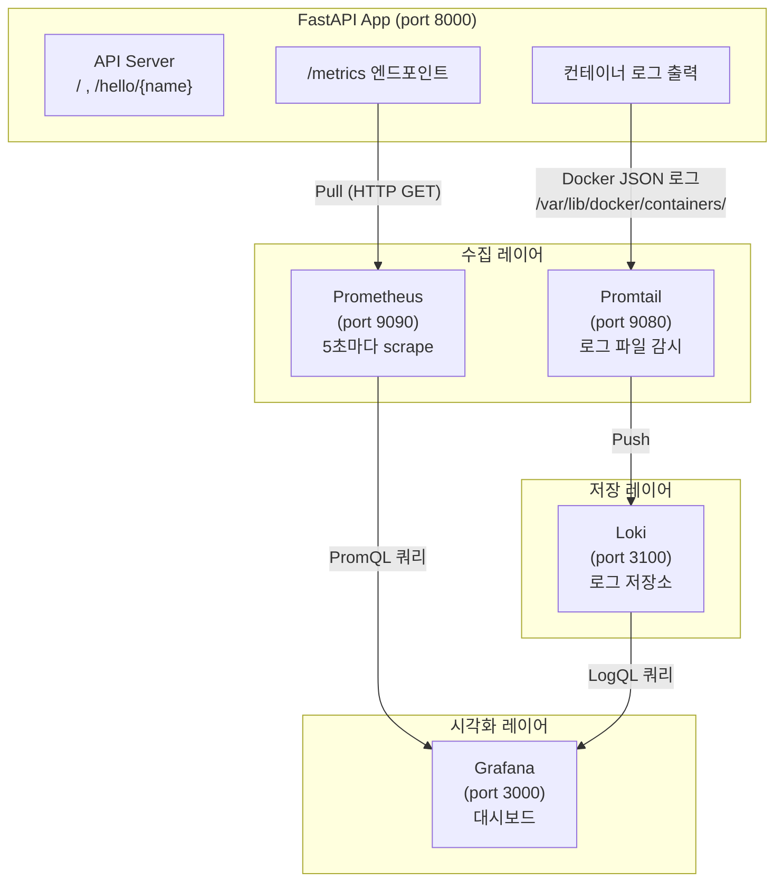

# FastAPI + Prometheus + Grafana + Loki 모니터링 스택

FastAPI 앱에 Prometheus, Grafana, Loki를 연동해서 **메트릭 모니터링**과 **로그 수집**을 처음부터 구축한 실습 프로젝트입니다.

---

## 전체 아키텍처



| 컴포넌트 | 역할 |
|----------|------|
| **FastAPI** | 실제 서비스 앱. `/metrics` 엔드포인트로 Prometheus 메트릭 노출 |
| **Prometheus** | FastAPI에서 메트릭을 주기적으로 수집(scrape)해서 저장 |
| **Grafana** | Prometheus와 Loki 데이터를 대시보드로 시각화 |
| **Loki** | 로그를 저장하는 백엔드 (Prometheus의 로그 버전) |
| **Promtail** | Docker 컨테이너 로그를 수집해서 Loki로 전송하는 에이전트 |

---

## 프로젝트 구조

```
.
├── app/
│   └── main.py                  # FastAPI 앱 + Prometheus 메트릭 설정
├── prometheus/
│   └── prometheus.yml           # Prometheus scrape 설정
├── promtail/
│   └── config.yml               # Promtail 로그 수집 설정
├── Dockerfile                   # FastAPI 앱 컨테이너 빌드 설정
├── docker-compose.yml           # 전체 스택 오케스트레이션
├── requirements.txt             # Python 패키지 목록
├── .pre-commit-config.yaml      # 코드 품질 자동화 (black, isort, flake8)
└── .gitignore
```

---

## 기술 스택

- **FastAPI** `0.136.3` — Python 웹 프레임워크
- **uvicorn** `0.49.0` — ASGI 서버
- **prometheus-fastapi-instrumentator** `7.1.0` — FastAPI 메트릭 자동 수집
- **Prometheus** `latest` — 메트릭 수집 및 저장
- **Grafana** `latest` — 모니터링 대시보드
- **Loki** `2.9.0` — 로그 저장소
- **Promtail** `2.0.0` — 로그 수집 에이전트

---

## 실행 방법

### 사전 요구사항

- [Docker](https://www.docker.com/) 및 Docker Compose 설치 필요

### 1. 저장소 클론

```bash
git clone <repository-url>
cd <project-directory>
```

### 2. 도커 실행

```bash
docker compose up --build
```


### 3. 각 서비스 접속

| 서비스 | URL | 설명 |
|--------|-----|------|
| FastAPI | http://localhost:8000 | 메인 앱 |
| FastAPI Docs | http://localhost:8000/docs | Swagger UI |
| FastAPI Metrics | http://localhost:8000/metrics | Prometheus 메트릭 원문 |
| Prometheus | http://localhost:9090 | 메트릭 쿼리 및 확인 |
| Grafana | http://localhost:3000 | 대시보드 (admin / admin) |
| Loki | http://localhost:3100 | 로그 저장소 |
| Promtail | http://localhost:9080 | 로그 수집 상태 확인 |

### 4. 종료

```bash
docker compose down
```

데이터(볼륨)까지 삭제하려면:

```bash
docker compose down -v
```

---

## Grafana 사용 방법

### 데이터 소스 추가

1. http://localhost:3000 접속 (초기 계정: `admin` / `admin`)
2. 좌측 메뉴 → **Connections > Data sources**
3. **Prometheus** 추가
   - URL: `http://prometheus:9090`
4. **Loki** 추가
   - URL: `http://loki:3100`

### 대시보드에서 메트릭 확인

- Explore 메뉴 → Prometheus 선택 후 PromQL 쿼리 입력
- 예: `http_requests_total` — 전체 요청 수
- 예: `http_request_duration_seconds_bucket` — 응답 시간 분포
- 예: `http_requests_inprogress` — 현재 처리 중인 요청 수

### 대시보드에서 로그 확인

- Explore 메뉴 → Loki 선택
- Label filters에서 `job = fastapi` 선택

---

## FastAPI 엔드포인트

| Method | Path | 설명 |
|--------|------|------|
| GET | `/` | Hello! 메시지 반환 |
| GET | `/hello/{name}` | 이름을 받아 인사 반환 |
| GET | `/metrics` | Prometheus 메트릭 노출 (자동 생성) |

---

## 개발 환경 설정

### Python 가상환경 및 패키지 설치

```bash
python -m venv venv
source venv/bin/activate  # Windows: venv\Scripts\activate
pip install -r requirements.txt
```

### pre-commit 훅 설치 (코드 품질 자동화)

```bash
pip install pre-commit
pre-commit install
```

커밋 시 자동으로 아래 도구가 실행됩니다:

- **black** — 코드 포맷팅 (최대 줄 길이 120)
- **isort** — import 구문 정렬
- **flake8** — 코드 스타일 검사

---

## 모니터링 동작 원리

### 메트릭 흐름

1. FastAPI 앱이 시작되면 `prometheus-fastapi-instrumentator`가 모든 HTTP 요청을 자동으로 측정
2. `/metrics` 엔드포인트에서 수집된 데이터를 Prometheus 형식으로 노출
3. Prometheus가 5초마다 `/metrics`를 호출해서 데이터를 저장
4. Grafana가 Prometheus에 쿼리해서 대시보드로 시각화

### 로그 흐름

1. FastAPI 앱이 Docker 컨테이너에서 로그를 출력
2. Docker가 로그를 `/var/lib/docker/containers/` 경로에 JSON 형식으로 저장
3. Promtail이 해당 경로를 감시하다가 새 로그를 발견하면 Loki로 전송
4. Grafana가 Loki에 쿼리해서 로그를 조회

---

## 예시 이미지
grafana dashboard에서 prometheus 메트릭 정보 등록해서 만든것


grafana explore에서 loki 로그 데이터 조회
